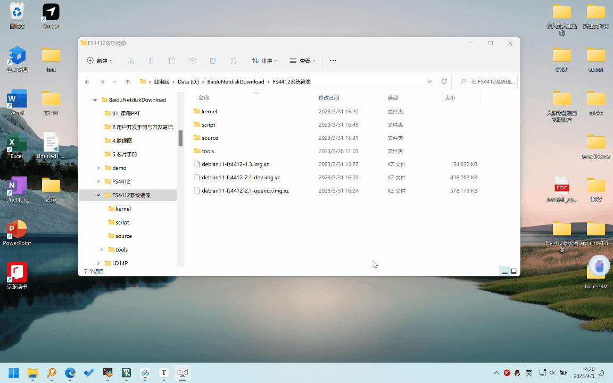

# FS4412开发板Debian系统镜像

#### 镜像介绍
使用debootstrap工具将Debian 11移植到FS4412开发板，主要用于项目实战授课和实训项目，不同项目可以根据需要进行定制。

#### 目录和版本说明

| 镜像文件                        | 说明                                                         |
| ------------------------------- | ------------------------------------------------------------ |
| debian11-fs4412-base-X.img.xz   | 基础镜像，只包含最基础的软件包，用于二次开发定制，不建议直接使用。 |
| debian11-fs4412-dev-X.img.xz    | 开发环境镜像，在基础镜像中增加了C/C++本地编译工具链和常用开发工具。 |
| debian11-fs4412-opencv-X.img.xz | opencv相关项目镜像，在开发环境镜像中增加了opencv的相关函数库。 |

| 目录   | 说明                       |
| ------ | -------------------------- |
| kernel | 编译好的内核镜像和设备树   |
| script | 镜像打包和安装脚本         |
| source | 移植好的内核源码和配置文件 |
| tools  | 镜像烧写和制作工具         |

#### 下载地址
百度网盘：https://pan.baidu.com/s/1DIvD2-4iiR-w8IeIGD8SvA?pwd=gbi1 

提取码：gbi1

#### 镜像烧写

1. 准备一张容量4G以上的SD或Micro SD卡。
2. 下载烧写工具：[Etcher](https://www.balena.io/etcher)
3. 将SD卡插入读卡器，连接到开发电脑。
4. 使用烧写工具将下载的镜像文件烧写到SD卡中。（需要以管理员身份运行）
    
5. 将SD卡插入FS4412的卡槽中，并将开发板上的OM拨码开关设置为从SD卡启动。
    
6. 打开开发板电源，从调试串口可以看到系统启动信息。
    
#### 使用说明

##### 登录
操作系统启动后，可以在串口2上使用`root`用户登录，登录密码为`hqyj`

##### 执行安装脚本
系统第一次启动后，建议执行/root目录中的`setup.sh`脚本，扩大根文件系统到整个SD卡，并生成机器ID。否则，可能出现根文件系统空间不足和IP地址冲突等问题。

安装完成后，开发板会自动关机，但不会自动关闭电源。出现`reboot: System halted`信息后，可以关闭开发板电源。


##### 使用以太网卡联网
连接网线后，系统启动时会自动获取IP地址，可以使用`ip address`命令查看网络设备eth0的IP地址。

##### 使用安卓手机共享网络（iPhone暂不支持）
1. 使用USB数据线将手机连接到开发板。
2. 打开`手机设置` > `个人热点` > `USB网络共享`。
   
3. 使用`ip address`命令查看网络设备usb0的IP地址。
   

##### 远程登录
系统默认安装了SSH服务，可以使用SSH客户端远程登录，用户名和密码与串口登录相同。

##### 更新内核和设备树
内核和设备树文件都存储在SD卡的FAT分区中，可以使用编译好的内核和设备树文件替换SD卡中的`uImage`和`exynos4412-fs4412.dtb`文件。

##### 访问SD卡FAT分区中的文件
- 在windows中可以直接访问SD卡FAT分区中的内容。
- 在开发板上，SD卡FAT分区会挂载到/mnt目录。

##### 安装软件
本系统是完整的Debian操作系统，可以使用`apt install 软件包`的方式安装Debian 11所有软件包。

##### 安全关机

直接关闭电源有可能造成文件丢失或损坏，建议先按下拨码开关旁边的power按键关机，等LED2（心跳灯）不再闪烁后，再关闭电源。


也可以使用以下命令关机：

```bash
# shutdown -H now
```

##### 驱动外设

- LED
- 按键
- 蜂鸣器
- 温度传感器
- IMU

[使用方法](interface.md)

#### 定制镜像

1. [编译内核及设备树](kernel.md)
2. 使用`apt`命令增加软件包
3. 制作镜像


#### 常见问题

1. 更新软件包时出现错误
    ```bash
    root@debian:~# apt update
    Hit:1 http://mirrors.tuna.tsinghua.edu.cn/debian bullseye InRelease
    Get:2 http://mirrors.tuna.tsinghua.edu.cn/debian bullseye-updates InRelease [44.1 kB]
    Get:3 http://mirrors.tuna.tsinghua.edu.cn/debian bullseye-backports InRelease [49.0 kB]
    Get:4 http://mirrors.tuna.tsinghua.edu.cn/debian-security bullseye-security InRelease [48.4 kB]
    Reading package lists... Done
    E: Release file for http://mirrors.tuna.tsinghua.edu.cn/debian/dists/bullseye/InRelease is not valid yet (invalid for another 131d 20h 48min 31s). Updates for this repository will not be applied.
    E: Release file for http://mirrors.tuna.tsinghua.edu.cn/debian/dists/bullseye-updates/InRelease is not valid yet (invalid for another 235d 12h 57min 50s). Updates for this repository will not be applied.
    E: Release file for http://mirrors.tuna.tsinghua.edu.cn/debian/dists/bullseye-backports/InRelease is not valid yet (invalid for another 235d 12h 57min 49s). Updates for this repository will not be applied.
    E: Release file for http://mirrors.tuna.tsinghua.edu.cn/debian-security/dists/bullseye-security/InRelease is not valid yet (invalid for another 235d 8h 57min 29s). Updates for this repository will not be applied.
      
    ```
    原因是系统时间没有同步，需要连上网络，等待ntpd同步时间后即可恢复正常。

2. 镜像烧录时出现以下错误，一般是由于没有使用管理员身份运行烧写程序导致的。
   