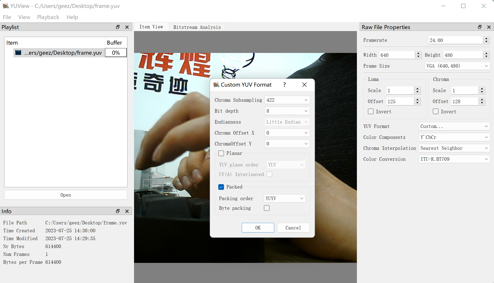

# 编译工具链

由于开发板上运行的是完整的debian操作系统，因此可以直接在开发板上使用本地编译工具链：

```bash
$ gcc hello.c -o hello
$ ./hello
hello, world
```

也可以在虚拟机的Ubuntu中安装交叉编译工具链：

```bash
$ sudo apt install gcc-arm-linux-gnueabihf
```

在Ubuntu中交叉编译：

```bash
$ arm-linux-gnueabihf-gcc hello.c -o hello
```

然后将编译好的程序上传到开发板或者复制到SD卡的FAT分区中，再运行。

# 读取温度传感器信息

可以通过sysfs文件系统读取底板上的DS18B20温度传感器信息

```bash
$ cat /sys/bus/w1/devices/28-*/temperature
28812
```

文件路径中的`*`号用来匹配传感器芯片ID，每个开发板不同。

读取出来的数字除以1000即为当前温度，单位是摄氏度。

# 读取电位器电压

可以通过sysfs文件系统读取底板上的电位器电压（ADC通道3）

```bash
$ cat /sys/bus/iio/devices/iio\:device0/in_voltage3_raw
1574
```

电压测量范围0~3.3V，精度12位，数值范围0-4095。

$V = \frac{V_{raw}}{4095}\times3300 mV $

# 控制和读取LED灯状态

LED2是心跳指示灯，CPU工作期间会定时闪烁。

LED3 - LED5可以通过程序控制，可以通过sysfs控制和读取LED灯状态。

```bash
# 打开LED3
$ echo 1 > /sys/class/leds/led3/brightness

# 关闭LED3
$ echo 0 > /sys/class/leds/led3/brightness

# 读取LED状态
$ cat /sys/class/leds/led3/brightness
1
```

# 读取按键状态

底板上有3个用户按键，power按键用于关机，音量+-按键的状态可以通过程序读取。

示例代码：

```C
#include <sys/types.h>
#include <sys/stat.h>
#include <fcntl.h>
#include <unistd.h>
#include <linux/input.h>
#include <linux/input-event-codes.h>
#include <stdio.h>

int main()
{
    //打开按键设备
    int fd = open("/dev/input/event1", O_RDONLY);
    if (fd < 0)
    {
        perror("open");
        return 1;
    }

    while(1)
    {
        //阻塞读取按键事件
        struct input_event ev;
        read(fd, &ev, sizeof(ev));
        //只处理按键事件
        if (ev.type == EV_KEY)
        {
            //判断按键编码（不同按键编码不同）
            if (ev.code == KEY_UP)
            {
                //判断按键状态
                if (ev.value == 1)
                {
                    //按键按下
                    printf("key up pressed\n");
                }

                if (ev.value == 0)
                {
                    //按键抬起
                    printf("key up released\n");
                }
            }

            if (ev.code == KEY_DOWN)
            {
                //判断按键状态
                if (ev.value == 1)
                {
                    //按键按下
                    printf("key down pressed\n");
                }

                if (ev.value == 0)
                {
                    //按键抬起
                    printf("key down released\n");
                }
            }
        }
    }

    close(fd);
}
```

如果不想阻塞读取按键状态，可以使用`select`等多路复用方式监控设备文件。

# 获取陀螺仪和加速度计数据

可以通过sysfs读取底板上的MPU6050传感器信息：

```bash
# 获取XYZ方向加速度
$ cat /sys/bus/i2c/devices/5-0068/iio\:device1/in_accel_x_raw
498
$ cat /sys/bus/i2c/devices/5-0068/iio\:device1/in_accel_y_raw
-100
$ cat /sys/bus/i2c/devices/5-0068/iio\:device1/in_accel_z_raw
16932

# 获取XYZ方向角速度
$ cat /sys/bus/i2c/devices/5-0068/iio\:device1/in_anglvel_x_raw
-38
$ cat /sys/bus/i2c/devices/5-0068/iio\:device1/in_anglvel_y_raw
6
$ cat /sys/bus/i2c/devices/5-0068/iio\:device1/in_anglvel_z_raw
1
```

# 控制蜂鸣器

可以通过以下程序控制底板上的无源蜂鸣器：

```C
#include <stdint.h>
#include <string.h>
#include <fcntl.h>
#include <unistd.h>
#include <stdio.h>
#include <linux/input.h>
#include <unistd.h>

//参数hz是蜂鸣器声音频率，设置为0停止蜂鸣器
void tone(int hz)
{
    int fd = open("/dev/input/event0", O_WRONLY);
    if (fd < 0)
    {
        perror("open");
        return;
    }
    struct input_event ev;
    ev.type = EV_SND;
    ev.code = SND_TONE;
    ev.value = hz;
    write(fd, &ev, sizeof(ev));
    close(fd);
}

int main()
{
        while(1)
        {
                tone(500);
                sleep(1);
                tone(0);
                sleep(1);
        }
        return 0;
}
```

# UVC摄像头

1. 列出系统中的视频设备，找到摄像头对应的设备文件`/dev/video1`

```bash
# v4l2-ctl --list-devices
USB2.0 PC CAMERA: USB2.0 PC CAM (usb-5800d000.usbh-ehci-1.2):
        /dev/video1
        /dev/video2
        /dev/media0
```

2. 查询摄像头支持的图像格式

```bash
# v4l2-ctl -d /dev/video1 --list-formats-ext
ioctl: VIDIOC_ENUM_FMT
        Type: Video Capture

        [0]: 'YUYV' (YUYV 4:2:2)
                Size: Discrete 640x480
                        Interval: Discrete 0.033s (30.000 fps)
                        Interval: Discrete 0.067s (15.000 fps)
                Size: Discrete 352x288
                        Interval: Discrete 0.033s (30.000 fps)
                        Interval: Discrete 0.067s (15.000 fps)
                Size: Discrete 320x240
                        Interval: Discrete 0.033s (30.000 fps)
                        Interval: Discrete 0.067s (15.000 fps)
                Size: Discrete 176x144
                        Interval: Discrete 0.033s (30.000 fps)
                        Interval: Discrete 0.067s (15.000 fps)
                Size: Discrete 160x120
                        Interval: Discrete 0.033s (30.000 fps)
                        Interval: Discrete 0.067s (15.000 fps)

```

3. 采集图像，并保存到`frame.yuv`文件中。

```bash
v4l2-ctl -d /dev/video1 --stream-mmap --stream-to=frame.yuv --stream-count=1 --set-fmt-video=width=640,height=480,pixelformat='YUYV'
```

--stream-mmap：使用内存映射方式获取图像数据

--stream-to=frame.yuv：将图像数据保存到`frame.yuv`文件

--stream-count=1：只采集一帧图像

--set-fmt-video=width=640,height=480,pixelformat='YUYV'：

设置图像格式：分辨率640x480，像素颜色数据使用YUV 422格式存储。

4. 在Windows上使用`YUView`程序查看捕获的图像，需要配置图像大小以及YUV格式（YUYV 4:2:2 8-bit packed）。


