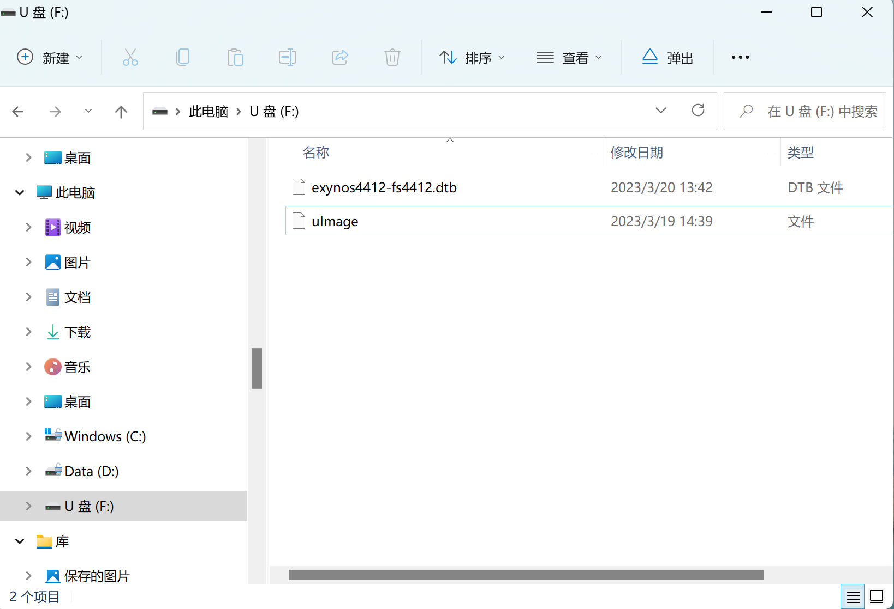

## 编译内核

由于开发板性能限制，内核编译建议在虚拟机上进行。

1. 在Ubuntu中安装依赖软件包

```bash
$ sudo apt install build-essential gcc-arm-linux-gnueabihf flex bison u-boot-tools libssl-dev
```

2. 解压源码包

```bash
$ tar -axf linux-source-5.10-fs4412.tar.xz
```

3. 配置环境变量

```bash
$ export ARCH=arm CROSS_COMPILE=arm-linux-gnueabihf-
```

4. 编译内核镜像

```bash
$ cd linux-source-5.10
$ make uImage LOADADDR=0x40008000
```

5. 编译设备树

```bash
$ make dtbs
```

6. 使用新编译的内核和设备树，直接将编译好的uImage和dtb文件拷贝到SD卡的windows分区中，覆盖同名文件。

